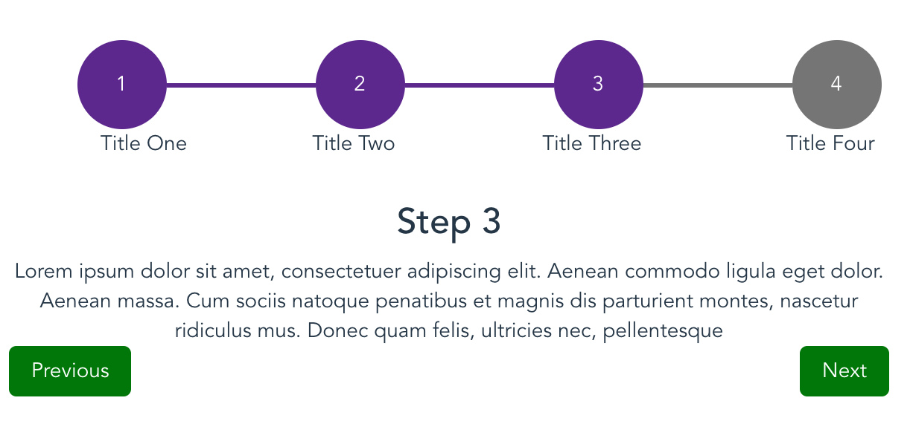

# VueJs Stepper
Simple stepper component for vuejs




## Requirements

- [Vue.js](https://github.com/vuejs/vue) `^2.x`

## Installation

### npm
``` bash
$ npm install vuejs-stepper
```

## Usage
``` html
<template>
    <stepper :options="stepperOptions">
        <div slot="step-1">
            <h3>Step 1</h3>
            Lorem ipsum dolor sit amet, consectetuer adipiscing elit. Aenean commodo ligula eget dolor. Aenean massa. Cum sociis natoque penatibus et magnis dis parturient montes, nascetur ridiculus mus. Donec quam felis, ultricies nec, pellentesque 
        </div>
        
        <div slot="step-2">
            <h3>Step 2</h3>
            Lorem ipsum dolor sit amet, consectetuer adipiscing elit. Aenean commodo ligula eget dolor. Aenean massa. Cum sociis natoque penatibus et magnis dis parturient montes, nascetur ridiculus mus. Donec quam felis, ultricies nec, pellentesque 
        </div>
        
        <div slot="step-3">
            <h3>Step 3</h3>
            Lorem ipsum dolor sit amet, consectetuer adipiscing elit. Aenean commodo ligula eget dolor. Aenean massa. Cum sociis natoque penatibus et magnis dis parturient montes, nascetur ridiculus mus. Donec quam felis, ultricies nec, pellentesque 
        </div>
        
        <div slot="step-4">
            <h3>Step 4</h3>
            Lorem ipsum dolor sit amet, consectetuer adipiscing elit. Aenean commodo ligula eget dolor. Aenean massa. Cum sociis natoque penatibus et magnis dis parturient montes, nascetur ridiculus mus. Donec quam felis, ultricies nec, pellentesque 
        </div>
    </stepper>
</template>

<script>
import Stepper from 'vuejs-stepper'
export default {
  components: { Stepper },
  data () {
    return {
      stepperOptions: {
        headers: [
          {title: 'Title One'},
          {title: 'Title Two'},
          {title: 'Title Three'},
          {title: 'Title Four'}
        ],
        prevText: 'Previous',
        nextText: 'Next'
      }
    }
  }
};
</script>
```
### Todo
- Color customization
- Allow changing of current step
## License

[The MIT License](http://opensource.org/licenses/MIT)
